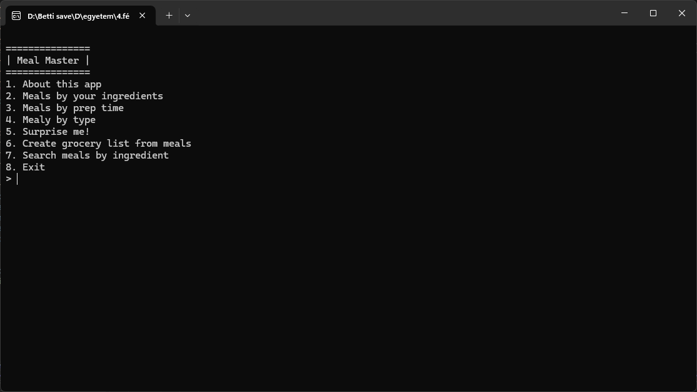

# Meal Master

Meal Master is a command-line meal planning application built in **F#**. It helps the user decide what to cook based on the ingredients they have, the time they have available, or by selecting from various meal types.

---

## Features

- Ingredient-based meal suggestions
- Prep time filter
- Meal type filter
- Random generated meal for a surprise
- Meal search by ingredient
- Grocery list generator

---

## How to Build & Run

1. Make sure you have the [.NET 8 SDK](https://dotnet.microsoft.com/en-us/download) installed.
2. Clone the repo:
   ```bash
   git clone https://github.com/bettiberec/DBWLPG_Project_Alpha
   cd MealMaster
   ```
3. Make sure you have the foods.json file placed in:
   ```bash
   bin/Debug/net8.0
   ```
4. Run the app:
   ```bash
   dotnet run
   ```
---
## Previews




